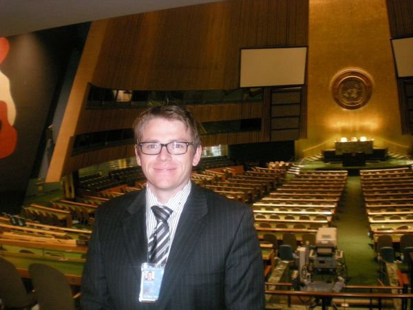

It feels like aeons ago, but back in 2010, I was fortunate enough to score a three-month internship at United Nations headquarters in New York. And even more than a decade on, this life-changing experience still creates opportunities for me today. 

In the following article, I want to outline the main benefits of overseas work and study experiences and how they may benefit you in life satisfaction and the labour market. 

Working at the chief institution for peace and internationalism is an oft-quoted goal of many young idealistic people. A part-time idealist myself, I got to experience the reality of this, albeit on a smaller scale than, say, [Kofi Annan](https://en.wikipedia.org/wiki/Kofi_Annan).

A decade ago, while studying for my Master of International Studies, I journeyed from Brisbane, Australia, to New York City to take up an internship position at the United Nations (UN) headquarters. 

This global mobility experience ended up altering life for the better - primarily in developing long-lasting professional networks that you can leverage as career capital. 

The following outlines my more detailed reasoning about why I think this and why I think all students should seriously consider an overseas work or study experience. 

## Getting to the United Nations

I was two-thirds of the way through my postgraduate studies when the email landed in my inbox. 

After a months-long process of applications and interviews, I'd finally been offered an intern position in the *Integrated Training Service* within the *Department of Peacekeeping Operations* (DPKO) at UN headquarters in New York.

A month after signing the formal offer, I was on a plane, leaving the oppressive heat of the Australian summer for the freezing New York winter.

At the time, you might say I was a cockeyed optimist, looking to get mixed up in the high stakes games of world diplomacy and international intrigue. 

But the reality of working at the United Nations ended up being much different. Something I probably should have expected given my lowly rank of associate. 

Rather than solving the world's security problems, the UN engaged my skills in information technology and communications to help build an application platform for training UN peacekeepers deployed all over the globe.

Yes, my internship was more administrative work than anything else, but it wasn't dull, and I got to work with a genuinely multicultural team, with people from every nook and cranny of the globe working side by side.

I recall working beside a friendly Chinese colleague with building some simple databases to track financials. He would turn up every day in full military garb, and later I found out he was a top-ranking army officer doing an offshore stint at the UN. Such diversity in both culture and profession was commonplace at the United Nations.

It wasn't all administrative work, though, and I did get to attend some exciting events. For example, my fellow interns and I got to sit in on Security Council debates and make regular visits to state missions to chat with high-level diplomats.

I was also lucky enough to help edit and publish the UN internship newsletter and run various committees that organised social events for my fellow interns. 

And the interns were a social bunch, with the cohort regularly hanging out doing things like ice skating in Central Park, heading to rock'n'roll karaoke at Arlene's Grocery in the Lower East Side and even participating in mid-morning viewings of English Premier League matches in Midtown Manhatten.

The internship program was a delightful tapestry of work and social experiences. While I loved my time in New York, arguably, I only reaped the full benefits of the experience after I'd returned home to Australia.

## Overseas experience as career leverage

A few years back, I had applied for a new position, and I had a good friend (who just happened to be an HR expert) review my CV. 

"Darragh, you MUST place the fact that you worked at the United Nations in the very first line of your CV!"

"But, it was only an internship, and I was only there for a relatively short time", I responded.

"You do not understand, Darragh; *this is a key selling point*. It is one  way you **differentiate yourself from other candidates**."

My friend was 100% right (thanks, Jo!). I got the job I was applying for, and I'd like to think that my UN experience increased the likelihood of me getting an interview. I realise now that the long-term value of my overseas experience was not the work experience I developed from turning up every day.

Instead, the value of this experience was that it enabled me to leverage the brand power of the United Nations. I increased my attractiveness to potential employers simply by being associated with a well-known and respected international organisation.

People recognise that where you work can be prestigious even if they have little direct knowledge of the actual work you happen to do there. Have a quick think, how many people do you know who may have at one stage expressed a desire to work at the United Nations? I guarantee at least one, likely many more. The UN is prestigious, even if its relevance in modern geopolitics is questionable. 

Be strategic about such experiences, and if you get the chance to build your unique selling point via work experience with a well-known institution or business, you should seriously consider the opportunity. 

## The making of a global graduate

The labour market is increasingly demanding highly-skilled graduates with a global perspective. Rob Lawrence (Prospect Marketing and Research) wrote back in 2014:

"*Employers are no longer restricting their focus to local, but global. So, employers will not only expect, they will demand something extra, that something which makes students stand-alone as globally networked global ambassadors, who are all global citizens.*" ([Source](http://www.ieaa.org.au/documents/item/322))

My time at the United Nations did precisely this, defining me as a global citizen.

My analytics and IT background with a bit of history and international politics thrown in for good measure. 

But my time at the UN showed all my subsequent supervisors and colleagues that I'm not simply an IT graduate looking for a paycheck in an industry that typically doesn't employ many IT people. Instead, it flags me as a data-nerd who has a genuine interest in how the world operates.

Being a graduate with a global perspective and the experience to back it up is usually valued in the labour market. Everyone should consider doing a stint overseas in an appropriate field or institution to improve employability.

## Global mobility creates networks

In June 2016, I flew to Europe for a long-overdue holiday. There, I attended various weddings of families and friends and even managed to pop over to France to catch the first few stages of the Tour De France.
But, I also spent a glorious week travelling through Malta with a couple of top-quality human beings, two of which were my best buddies from my UN internship program.

I was still travelling the globe and hanging out with people I worked alongside seven years earlier in New York. And this wasn't the first time either.

I'd trekked the jungles of Malaysia and climbed remote volcanoes in Indonesia with UN internship pals. I've had former interns stay at my home while they've been passing through Australia. Hell, I even went to the wedding of one of my intern friends in a castle in Wales!

And it's not just me. I see many of my former intern colleagues regularly catching up in weird and beautiful places worldwide. The bonds formed through these shared global experiences are probably the most valuable gift the UN internship programme gave me.

And many of my former internship colleagues are now kicking some awe-inspiring goals in their post-UN careers. For example, one works at Associated Press as an up and coming specialist in the field of artificial intelligence and journalism. Another is a human rights lawyer in the Netherlands. Another finished his PhD at Cambridge not long after the internship and is now kicking goals in international development. A few others work in revolutionary tech start-ups in the US and throughout Europe, while some stayed at the UN to continue the work of this iconic international institution.

These are global graduates, gaining career capital in their respective fields and likely to be future leaders in some way, shape or form (if they're not already). And some I haven't spoken to since my internship, but they're still a network I can learn from or even lean on from time to time, even if it's only for inspiration.

The above highlights probably the most rewarding aspect of my global mobility experience - the creation of long-lasting and strong friendships and professional networks that deepen and improve one's professional standing and friendship circle. 

## Don't knock back opportunity

It seems strange to write that even in 2010, Australian university postgraduate coursework students undertaking overseas experiences seemed a relatively rare occurrence.

Nowadays, it's becoming more commonplace with both institutions and students alike realising the value of global mobility and its correlation to future employability. 

I've attempted to outline three interrelated benefits of overases work experience - firstly, that it will be hugely beneficial in the labour market. Secondly, that it will flag to others of your interest in global affairs (including employers), and finally, that such experiences supercharge both your professional and friendship networks. 

Reflecting on my own experience as an intern at the United Nations, I can say that not only has it proved insanely valuable to advancing my professional career, it was also a cherished turning point in my career as a human being.

If such an opportunity appears before you, for goodness sake, grab it and go.
